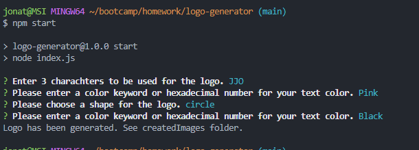
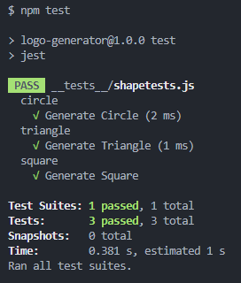

# Logo Generator

## Description

This program is a command-line application that will take in user input and create a logo based on the responses. There are some restrictions as far as shape, but any 3 letters can be added to the logo in combination with a background color and text color.

## Installation:

- Clone this github repo to your local workspace.
- Run "npm i" to install necessary packages.

## Usage:

To operate this program you must:
- Follow the installation guide above.
- Open your terminal and type "npm start"
- Answer the questions prompted to you through the terminal.
- If you have svg vs code preview extension installed you can just click on the newly created file and it will display.
-If you do not, then you will need to right click and open it to your browser.

## Screenshots:

### Command Line Prompts:

### Tests:

### Logo Example: 

## Link to Video Walkthrough:

https://drive.google.com/file/d/1Bj5Pz9Tjb94jHeB4k45TO6Py6AzGAiie/view
